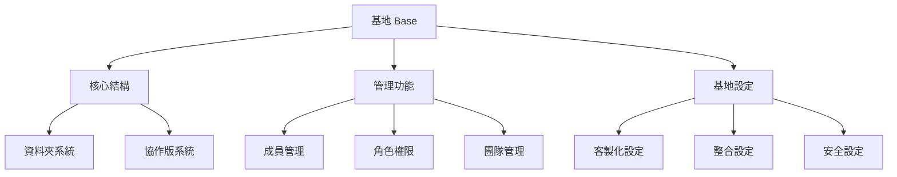
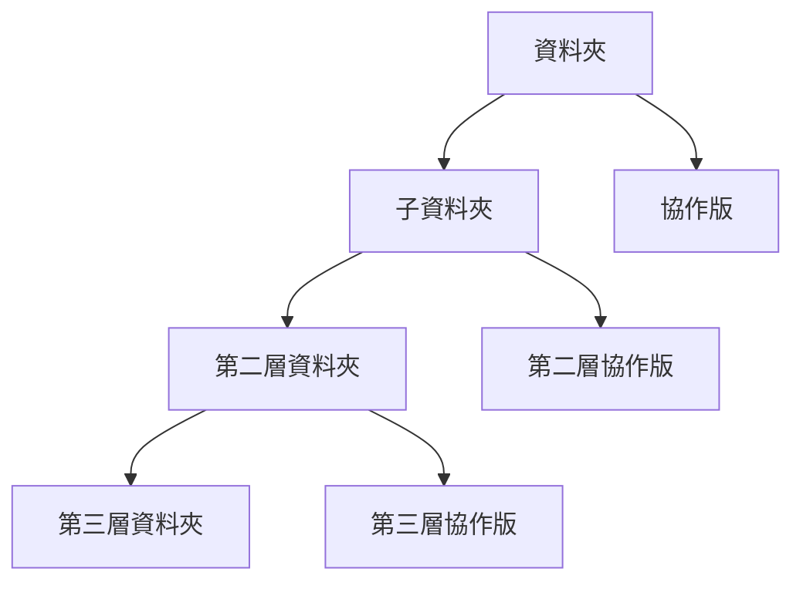
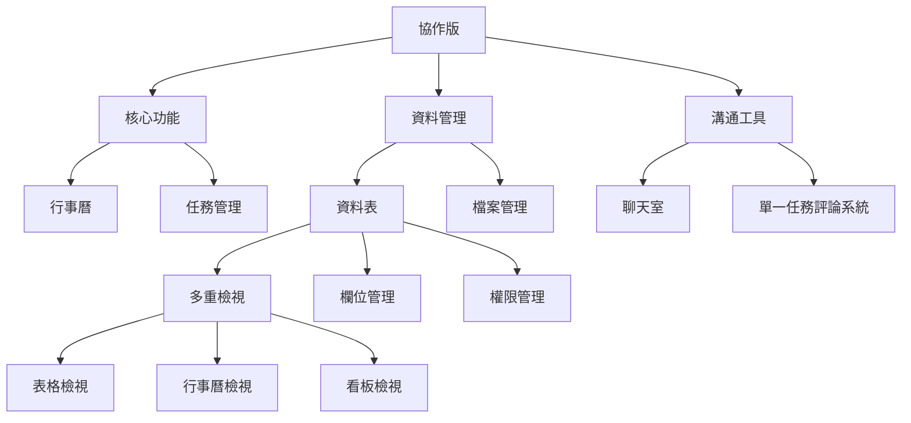

# Base, Folder 和 Board 結構

## 1. Base (基地) 結構

### 1.1 Base 核心結構



### 1.2 Base 數據模型

```dart
/// Base 是系統的最高層級組織單位
class Base {
  String id;               // 基地唯一識別符
  String name;             // 基地名稱
  String description;      // 基地描述
  DateTime createdAt;      // 創建時間
  DateTime updatedAt;      // 最後更新時間
  String ownerId;          // 創建者ID
  List<BaseRole> roles;    // 自定義角色列表
  List<BaseMember> members;// 成員列表
  List<BaseFolderOrBoard> contents; // 基地內容 (文件夾或協作版)
}

/// 基地角色 (RBAC - 基於角色的訪問控制)
class BaseRole {
  String id;               // 角色唯一識別符
  String name;             // 角色名稱
  String color;            // 角色顯示顏色
  Map<String, bool> permissions; // 權限映射 <權限名稱, 是否啟用>
}

/// 基地成員
class BaseMember {
  String userId;           // 用戶ID
  List<String> roleIds;    // 用戶擁有的角色ID列表
  DateTime joinedAt;       // 加入時間
  BaseMemberStatus status; // 成員狀態
}

/// 成員狀態枚舉
enum BaseMemberStatus {
  active,    // 活躍
  inactive,  // 非活躍
  invited,   // 已邀請未加入
  banned     // 已禁止
}

/// 基地權限枚舉
enum BasePermission {
  manageBase,           // 管理基地設置
  manageRoles,          // 管理角色
  manageMembers,        // 管理成員
  createFolder,         // 創建文件夾
  createBoard,          // 創建協作版
  viewAllContent,       // 查看所有內容
  manageAllContent,     // 管理所有內容
  // 更多權限...
}
```

### 1.3 Base 業務規則

1. **基地管理**
   - 每個基地必須有唯一的名稱
   - 只有基地創建者或具有 `manageBase` 權限的成員可以更改基地設置
   - 基地可以設置多個自定義角色，每個角色擁有不同的權限組合

2. **角色管理規則**
   - 每個基地必須至少有一個管理員角色，具有所有權限
   - 每個基地可以有多個自定義角色
   - 角色可以指派給多個成員
   - 一個成員可以擁有多個角色，權限疊加

3. **成員管理規則**
   - 基地創建者默認擁有所有權限，無法被降級或移除
   - 成員可以通過邀請鏈接或直接邀請加入基地
   - 成員可以被分配一個或多個角色
   - 成員可以被封禁，禁止訪問基地內容

## 2. Folder (文件夾) 結構

### 2.1 Folder 核心結構



### 2.2 Folder 數據模型

```dart
/// 基地內容項 (可以是文件夾或協作版)
abstract class BaseFolderOrBoard {
  String id;           // 唯一識別符
  String name;         // 名稱
  String description;  // 描述
  DateTime createdAt;  // 創建時間
  DateTime updatedAt;  // 最後更新時間
  String createdBy;    // 創建者ID
}

/// 文件夾結構
class Folder extends BaseFolderOrBoard {
  List<BaseFolderOrBoard> contents; // 文件夾內容 (子文件夾或協作版)
  int level;           // 文件夾層級 (最多3層)
  
  // 檢查是否可以添加子文件夾 (層級限制)
  bool canAddSubfolder() {
    return level < 3;
  }
}
```

### 2.3 Folder 業務規則

1. **嵌套規則**
   - 文件夾最多可嵌套 3 層 (根目錄 -> 文件夾 -> 子文件夾 -> 子子文件夾)
   - 協作版不能包含子文件夾或其他協作版

2. **訪問控制**
   - 可以針對特定文件夾或協作版設置更精細的訪問權限
   - 父級文件夾的訪問權限會影響子文件夾和協作版的默認訪問權限

## 3. Board (協作版) 結構

### 3.1 Board 核心結構



### 3.2 Board 數據模型

```dart
/// 協作版
class Board extends BaseFolderOrBoard {
  BoardChatroom chatroom;  // 版聊天室
  BoardCalendar calendar;  // 版行事曆
  List<MaiDB> databases;   // 版資料庫列表
  List<BoardMember> members; // 版成員列表
  List<BoardRole> roles;   // 版角色列表
}

/// 協作版角色
class BoardRole {
  String id;           // 角色唯一識別符
  String name;         // 角色名稱
  String color;        // 角色顯示顏色
  Map<String, bool> permissions; // 權限映射 <權限名稱, 是否啟用>
}

/// 協作版成員
class BoardMember {
  String userId;       // 用戶ID
  List<String> roleIds;// 用戶擁有的角色ID列表
  DateTime joinedAt;   // 加入時間
}

/// 協作版權限枚舉
enum BoardPermission {
  manageBoard,         // 管理協作版
  manageRoles,         // 管理角色
  manageMembers,       // 管理成員
  useChatroom,         // 使用聊天室
  manageCalendar,      // 管理行事曆
  viewCalendar,        // 查看行事曆
  createDatabase,      // 創建資料庫
  manageAllDatabases,  // 管理所有資料庫
  viewAllDatabases,    // 查看所有資料庫
  // 更多權限...
}
```

### 3.3 Board 業務規則

1. **協作版管理**
   - 每個協作版必須有唯一的名稱
   - 協作版可以包含聊天室、行事曆和多個資料庫
   - 協作版可以設置自己的角色和權限系統

2. **協作版角色系統**
   - 協作版可以設置獨立於基地的角色系統
   - 協作版角色權限僅在該協作版內有效
   - 基地管理員在所有協作版中自動擁有管理權限
   
3. **協作版功能**
   - 聊天室提供即時溝通
   - 行事曆整合時間相關資訊
   - 資料表存儲和管理結構化資料

### 3.4 聊天室和評論系統

```dart
/// 版聊天室
class BoardChatroom {
  String id;           // 聊天室唯一識別符
  String boardId;      // 所屬協作版ID
  List<ChatMessage> messages; // 聊天訊息
  List<ChatChannel> channels; // 聊天頻道
}

/// 聊天訊息
class ChatMessage {
  String id;           // 訊息唯一識別符
  String userId;       // 發送者ID
  String content;      // 訊息內容
  DateTime createdAt;  // 發送時間
  List<ChatReaction> reactions; // 訊息反應
  List<ChatAttachment> attachments; // 訊息附件
}

/// 聊天頻道
class ChatChannel {
  String id;           // 頻道唯一識別符
  String name;         // 頻道名稱
  ChannelType type;    // 頻道類型
  Map<String, bool> permissions; // 頻道特定權限
}

/// 頻道類型
enum ChannelType {
  text,      // 文字頻道
  voice,     // 語音頻道
}
```
