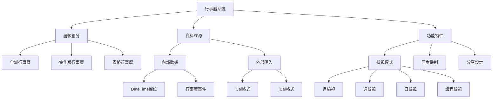

# 行事曆系統

Mai.today 的行事曆系統分為三個層級：全域行事曆（Global Calendar）、協作版行事曆（Board Calendar）和表格行事曆（MaiTable Calendar）。每個層級都有其特定的功能和數據來源。

## 1. 行事曆系統架構



## 2. 全域行事曆（Global Calendar）

### 2.1 概述

Global Calendar 是每個使用者可以自己定義的個人行事曆，跨多個 Bases，使用者可以選擇顯示來自不同 Board 和 MaiTable 的事件。

### 2.2 數據模型

```dart
/// 全域行事曆
class GlobalCalendar {
  String id;                      // 行事曆唯一識別符
  String userId;                  // 所屬用戶ID
  String name;                    // 行事曆名稱
  List<CalendarSource> sources;   // 行事曆數據來源
  Map<String, bool> settings;     // 行事曆設定
}

/// 行事曆數據來源
class CalendarSource {
  String id;                      // 來源唯一識別符
  CalendarSourceType type;        // 來源類型
  String sourceId;                // 來源ID（BoardID或MaiTableID或外部行事曆URL）
  bool isEnabled;                 // 是否啟用
  String color;                   // 顯示顏色
}

/// 行事曆來源類型
enum CalendarSourceType {
  boardCalendar,                  // 協作版行事曆
  maiTable,                       // 資料表
  externalCalendar,               // 外部行事曆
}
```

### 2.3 行事曆來源

1. **Board Calendar**
   - 直接整合來自協作版行事曆的事件
   - 可選擇特定協作版行事曆或全部

2. **MaiRow**
   - 來自包含 DateTime 欄位的 MaiTable 資料列
   - 可選擇特定 MaiTable 或特定欄位

3. **外部行事曆**
   - 支援匯入標準 iCal 格式
   - 支援 Google Calendar、Apple Calendar 等外部行事曆

### 2.4 功能規則

1. **顯示控制**
   - 使用者可以選擇要顯示的行事曆來源
   - 每個來源可以設定不同的顯示顏色
   - 可以隱藏/顯示特定來源

2. **同步機制**
   - 自動同步內部數據
   - 定期同步外部行事曆
   - 支援手動強制同步

3. **個人化設定**
   - 預設檢視模式（月/週/日）
   - 預設時區
   - 工作時間設定

## 3. 協作版行事曆（Board Calendar）

### 3.1 概述

協作版行事曆是在 Board 協作版空間裡面的行事曆，為整個 Mai 裡面核心的行事曆來源單位。團隊成員可以共同查看和管理事件。

### 3.2 數據模型

```dart
/// 協作版行事曆
class BoardCalendar {
  String id;                      // 行事曆唯一識別符
  String boardId;                 // 所屬協作版ID
  List<CalendarEvent> events;     // 行事曆事件
  List<CalendarCategory> categories; // 事件分類
  List<CalendarSource> sources;   // 外部行事曆來源
}

/// 行事曆事件
class CalendarEvent {
  String id;                      // 事件唯一識別符
  String title;                   // 事件標題
  String description;             // 事件描述
  DateTime startTime;             // 開始時間
  DateTime endTime;               // 結束時間
  bool isAllDay;                  // 是否為全天事件
  String locationText;            // 地點文字描述
  String locationUrl;             // 地點URL
  String categoryId;              // 分類ID
  String color;                   // 顏色（#RRGGBBAA）
  String createdBy;               // 創建者ID
  List<String> attendees;         // 參與者ID列表
  EventRepeat repeat;             // 重複設置
  EventReminder reminder;         // 提醒設置
  String timeZone;                // 時區
}

/// 事件分類
class CalendarCategory {
  String id;                      // 分類唯一識別符
  String name;                    // 分類名稱
  String color;                   // 顏色
}

/// 事件重複設定
class EventRepeat {
  RepeatType type;                // 重複類型
  int interval;                   // 間隔
  DateTime until;                 // 結束日期
  List<int> byDays;               // 按天重複（週重複時的星期幾）
  List<int> byMonthDays;          // 按月日重複
}

/// 重複類型
enum RepeatType {
  none,                           // 不重複
  daily,                          // 每日
  weekly,                         // 每週
  monthly,                        // 每月
  yearly,                         // 每年
  custom,                         // 自定義
}

/// 事件提醒
class EventReminder {
  List<ReminderTime> times;       // 提醒時間列表
  ReminderMethod method;          // 提醒方式
}

/// 提醒時間
class ReminderTime {
  int value;                      // 數值
  TimeUnit unit;                  // 單位
  bool isBeforeEvent;             // 是在事件前提醒
}

/// 時間單位
enum TimeUnit {
  minute,                         // 分鐘
  hour,                           // 小時
  day,                            // 天
  week,                           // 週
}

/// 提醒方式
enum ReminderMethod {
  notification,                   // 系統通知
  email,                          // 電子郵件
  both,                           // 兩者都有
}
```

### 3.3 行事曆來源

1. **自定義行事曆事件**
   - 直接在 Board Calendar 中創建和管理的事件
   - 支援各種事件屬性和重複模式

2. **MaiRow**
   - 來自協作版內 MaiTable 的 DateTime 欄位數據
   - 一個 MaiRow 可能出現多次在 Calendar 上（如果有多個 DateTime 欄位）

3. **外來行事曆來源**
   - 匯入通用的 iCal 格式
   - 支援訂閱外部行事曆

### 3.4 功能規則

1. **權限控制**
   - 根據協作版角色設定行事曆訪問權限
   - 可以設定誰能查看/編輯/刪除事件

2. **分類管理**
   - 創建和管理事件分類
   - 按分類過濾和顯示事件

3. **團隊協作**
   - 邀請成員參與事件
   - 事件通知和提醒
   - 事件評論和討論

## 4. 表格行事曆（MaiTable Calendar）

### 4.1 概述

表格行事曆是透過 Calendar View 行事曆視圖來顯示 MaiTable 中的資料。它將 MaiTable 中的 DateTime 欄位數據以行事曆形式展現。

### 4.2 行事曆視圖佈局

```dart
/// 行事曆視圖佈局
class CalendarViewLayout extends MaiTableLayout {
  String dateTimeColumnId;        // 作為時間依據的DateTime欄位ID
  CalendarViewType viewType;      // 視圖類型（月/週/日）
  CalendarDensity density;        // 顯示密度
  bool showWeekends;              // 是否顯示週末
  String workDayStart;            // 工作日開始時間
  String workDayEnd;              // 工作日結束時間
}

/// 行事曆視圖類型
enum CalendarViewType {
  month,                          // 月視圖
  week,                           // 週視圖
  day,                            // 日視圖
  agenda,                         // 議程視圖
}

/// 行事曆顯示密度
enum CalendarDensity {
  compact,                        // 緊湊
  comfortable,                    // 舒適
  spacious,                       // 寬敞
}
```

### 4.3 功能規則

1. **視圖切換**
   - 支援月視圖、週視圖、日視圖和議程視圖
   - 可以在視圖間自由切換

2. **欄位映射**
   - 指定哪個 DateTime 欄位作為事件時間
   - 指定事件標題、顏色等屬性映射

3. **篩選與排序**
   - 根據其他欄位值篩選事件
   - 自定義事件排序方式

4. **互動功能**
   - 拖放調整事件時間
   - 點擊事件查看詳情
   - 直接在行事曆上創建和編輯事件

## 5. DateTime 欄位與行事曆整合

### 5.1 DateTime 欄位配置

```dart
/// DateTime 欄位配置
class DateTimeColumnOptions {
  bool includeTime;              // 是否包含時間
  String format;                 // 日期格式
  bool isShowOnCalendar;         // 是否顯示在行事曆上
  CalendarTitleFormat calendarTitleFormat; // 行事曆標題格式
}

/// 行事曆標題格式
enum CalendarTitleFormat {
  rowTitle,                      // 行標題
  rowTitleAndColumnName,         // 行標題 - 時間欄位名稱
}
```

### 5.2 DateTime 欄位值

```dart
/// DateTime 欄位值
class DateTimeValue {
  String title;                  // 事件標題
  DateTime startTime;            // 開始時間
  DateTime endTime;              // 結束時間
  bool hasTime;                  // 是否包含時間
  bool hasEndTime;               // 是否有結束時間
  String color;                  // 顏色 (#RRGGBBAA)
  String timeZone;               // 時區
}
```

### 5.3 整合規則

1. **顯示控制**
   - 只有設置了 `isShowOnCalendar = true` 的 DateTime 欄位才會顯示在行事曆上
   - 行事曆上的事件標題由 `calendarTitleFormat` 決定

2. **數據流向**
   - MaiTable DateTime 欄位 → 表格行事曆視圖
   - MaiTable DateTime 欄位 → 協作版行事曆
   - 協作版行事曆 → 全域行事曆

3. **同步機制**
   - MaiTable 數據變更時自動更新行事曆
   - 在行事曆上修改事件可選擇更新原始數據

## 6. 外部行事曆整合

### 6.1 支援格式

- iCal (RFC 5545)
- jCal (JSON 格式的 iCalendar)
- Google Calendar API
- Microsoft Outlook Calendar API

### 6.2 整合方式

1. **訂閱外部行事曆**
   - 提供 iCal URL 進行訂閱
   - 設定同步頻率

2. **匯入外部行事曆**
   - 上傳 iCal 文件進行一次性匯入
   - 將外部事件轉換為內部事件

3. **匯出行事曆**
   - 將內部行事曆匯出為 iCal 格式
   - 生成可分享的行事曆訂閱鏈接

### 6.3 權限處理

- 外部行事曆資料默認為只讀
- 可以設定同步方向（單向或雙向）
- 可以設定哪些類型的事件允許同步
