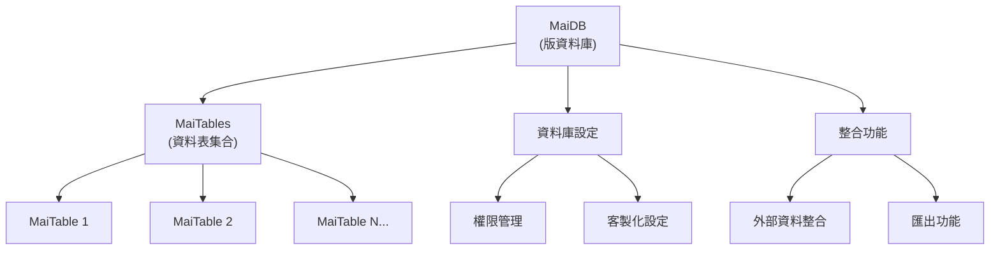
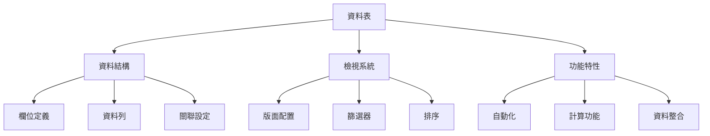

# MaiDB 與 MaiTable 結構

## 1. MaiDB (資料庫) 結構

### 1.1 MaiDB 核心結構

MaiDB 是版內的資料庫系統，每個協作版可以包含多個 MaiDB，每個 MaiDB 又可以包含多個 MaiTable。



### 1.2 MaiDB 數據模型

```dart
/// MaiDB 是版內的資料庫系統
class MaiDB {
  String id;           // 資料庫唯一識別符
  String boardId;      // 所屬協作版ID
  String name;         // 資料庫名稱
  String description;  // 資料庫描述
  DateTime createdAt;  // 創建時間
  DateTime updatedAt;  // 最後更新時間
  String createdBy;    // 創建者ID
  List<MaiTable> tables; // 資料庫中的所有表格
  Map<String, bool> permissions; // 資料庫特定權限
}
```

### 1.3 MaiDB 業務規則

1. **資料庫管理**
   - 每個 MaiDB 必須有唯一的名稱
   - MaiDB 可以包含多個 MaiTable
   - MaiDB 可以設置特定的訪問權限

2. **資料庫整合**
   - 支持導入/導出資料
   - 支持與外部系統整合
   - 提供 API 接口

## 2. MaiTable (資料表) 結構

### 2.1 MaiTable 核心結構



### 2.2 MaiTable 數據模型

```dart
/// MaiTable 代表一個資料表
class MaiTable {
  String id;           // 表格唯一識別符
  String name;         // 表格名稱
  String description;  // 表格描述
  DateTime createdAt;  // 創建時間
  DateTime updatedAt;  // 最後更新時間
  List<MaiColumn> columns; // 表格中的所有欄位
  List<MaiRow> rows;   // 表格中的所有資料列
  List<MaiTableLayout> layouts; // 表格視圖佈局
  Map<String, bool> permissions; // 表格特定權限
}

/// MaiColumn 代表表格中的欄位
class MaiColumn {
  String id;           // 欄位唯一識別符
  String name;         // 欄位名稱
  ColumnType type;     // 欄位類型
  bool isRequired;     // 是否為必填欄位
  bool isUnique;       // 是否為唯一值
  bool isSystem;       // 是否為系統欄位(如Title)
  dynamic defaultValue;// 默認值
  Map<String, dynamic> options; // 欄位特定配置選項
}

/// 欄位類型枚舉
enum ColumnType {
  title,          // 標題欄位(系統欄位,每個表必須有且只有一個)
  text,           // 文本
  richText,       // 富文本
  number,         // 數字
  singleSelect,   // 單選
  multiSelect,    // 多選
  people,         // 人員
  image,          // 圖片
  photo,          // 照片
  file,           // 文件
  link,           // 連結到其他MaiTable
  date,           // 日期
  datetime,       // 日期時間
  checkbox,       // 勾選框
  url,            // 網址
  email,          // 電子郵件
  phone,          // 電話
  formula,        // 公式
  rating,         // 評分
  currency,       // 貨幣
  duration,       // 時長
  lookup,         // 查詢
}

/// MaiRow 代表表格中的資料列
class MaiRow {
  String id;           // 資料列唯一識別符
  DateTime createdAt;  // 創建時間
  DateTime updatedAt;  // 最後更新時間
  String createdBy;    // 創建者ID
  String updatedBy;    // 最後更新者ID
  List<MaiCell> cells; // 資料列中的所有單元格
}

/// MaiCell 代表表格中的資料格
class MaiCell {
  String id;           // 單元格唯一識別符
  String rowId;        // 所屬資料列ID
  String columnId;     // 所屬欄位ID
  dynamic value;       // 單元格值
  DateTime updatedAt;  // 最後更新時間
  String updatedBy;    // 最後更新者ID
}

/// MaiTableLayout 代表表格視圖佈局
class MaiTableLayout {
  String id;           // 佈局唯一識別符
  String name;         // 佈局名稱
  LayoutType type;     // 佈局類型
  Map<String, dynamic> settings; // 佈局設置
  List<String> visibleColumns; // 可見欄位ID列表
  String sortBy;       // 排序欄位ID
  bool sortAscending;  // 是否升序排序
  String filterJson;   // 過濾條件JSON
}

/// 佈局類型枚舉
enum LayoutType {
  table,          // 表格檢視
  kanban,         // 看板檢視
  calendar,       // 行事曆檢視
  gallery,        // 畫廊檢視
  list,           // 列表檢視
  timeline,       // 時間線檢視
  gantt,          // 甘特圖檢視
}
```

### 2.3 欄位特定配置

```dart
/// 單選項目
class SelectOption {
  String id;      // 選項唯一識別符
  String name;    // 選項名稱
  String color;   // 選項顏色
}

/// 多選欄位配置
class MultiSelectColumnOptions {
  List<SelectOption> options; // 可選選項列表
}

/// 單選欄位配置
class SingleSelectColumnOptions {
  List<SelectOption> options; // 可選選項列表
}

/// 連結欄位配置
class LinkColumnOptions {
  String targetTableId; // 目標表格ID
  bool allowMultiple;   // 是否允許多值連結
}

/// 數字欄位配置
class NumberColumnOptions {
  String format;        // 數字格式(貨幣,百分比等)
  int precision;        // 小數位數
  bool allowNegative;   // 是否允許負數
}

/// 日期時間欄位配置
class DateTimeColumnOptions {
  bool includeTime;        // 是否包含時間
  String format;           // 日期格式
  bool isShowOnCalendar;   // 是否顯示在行事曆上
  CalendarTitleFormat calendarTitleFormat; // 行事曆標題格式
}

/// 行事曆標題格式
enum CalendarTitleFormat {
  rowTitle,               // 行標題
  rowTitleAndColumnName,  // 行標題 - 時間欄位名稱
}
```

### 2.4 欄位值類型

```dart
/// Title欄位值(系統欄位)
class TitleValue {
  String text;          // 標題文字
}

/// 文本欄位值
class TextValue {
  String text;          // 文本內容
}

/// 富文本欄位值
class RichTextValue {
  String html;          // HTML 格式內容
  List<RichTextBlock> blocks; // 富文本塊
}

/// 數字欄位值
class NumberValue {
  double value;         // 數字值
}

/// 單選欄位值
class SingleSelectValue {
  String optionId;      // 所選選項ID
}

/// 多選欄位值
class MultiSelectValue {
  List<String> optionIds; // 所選選項ID列表
}

/// 人員欄位值
class PeopleValue {
  List<String> userIds; // 人員ID列表
}

/// 圖片欄位值
class ImageValue {
  List<String> imageUrls; // 圖片URL列表
}

/// 連結欄位值
class LinkValue {
  List<String> linkedRecordIds; // 被連結記錄ID列表
}

/// 日期時間欄位值
class DateTimeValue {
  String title;         // 事件標題
  DateTime startTime;   // 開始時間
  DateTime endTime;     // 結束時間
  bool hasTime;         // 是否包含時間
  bool hasEndTime;      // 是否有結束時間
  String color;         // 顏色 (#RRGGBBAA)
  String timeZone;      // 時區
}

/// 勾選框欄位值
class CheckboxValue {
  bool checked;         // 是否勾選
}
```

### 2.5 MaiTable 業務規則

1. **Title 欄位規則**:
   - 每個 MaiTable 必須有且只有一個 Title 欄位
   - Title 欄位不能被刪除或新增
   - Title 欄位類型不能被更改
   - Title 欄位值不能為空

2. **欄位管理規則**:
   - 用戶可以自由添加、編輯和刪除非系統欄位
   - 每個欄位必須有唯一的名稱(在同一表格內)
   - 欄位順序可以調整，但系統欄位(Title)總是顯示在首位

3. **關聯欄位規則**:
   - Link 欄位可以關聯到同一協作版中的其他 MaiTable
   - Link 欄位可以設置為單選或多選(0-N筆關聯)
   - 刪除 MaiTable 時，會檢查是否有其他表的 Link 欄位關聯到它

4. **視圖佈局規則**:
   - 每個 MaiTable 可以有多個視圖佈局
   - 不同佈局可以設置不同的欄位顯示、排序和過濾條件
   - 佈局設置不影響原始數據，僅影響數據的展示方式

## 3. DateTime Column 功能

### 3.1 DateTime Column 用戶故事

**管理 MaiTable 的 DateTime Column**

作為 MaiTable 的使用者，我想要在我的表格中有一個靈活的 DateTime 欄位，以便我可以記錄和管理與時間相關的數據，並在需要時將其顯示在行事曆上。

### 3.2 DateTime Column 設計

```dart
/// DateTime 欄位配置
class DateTimeColumnOptions {
  bool includeTime;        // 是否包含時間
  String format;           // 日期格式
  bool isShowOnCalendar;   // 是否顯示在行事曆上
  CalendarTitleFormat calendarTitleFormat; // 行事曆標題格式
}

/// DateTime 欄位值
class DateTimeValue {
  String title;         // 事件標題
  DateTime startTime;   // 開始時間
  DateTime endTime;     // 結束時間
  bool hasTime;         // 是否包含時間
  bool hasEndTime;      // 是否有結束時間
  String color;         // 顏色 (#RRGGBBAA)
  String timeZone;      // 時區
}
```

###