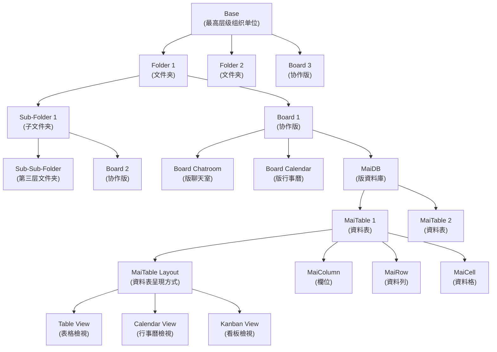

# Mai.today 產品規格書

## 1. 產品概述

Mai.today 是一款集成協作平台，結合了類似 Notion、Airtable 和 Discord 的特點，提供多層級組織結構、自訂資料庫和基於角色的訪問控制系統。產品設計支持團隊協作，資料管理和項目追蹤等功能。

## 2. 系統架構

Mai.today 採用多層級結構組織內容和功能：

1. **Base** - 最高層級組織單位
2. **Folder** - 可嵌套的內容分類單元 (最多3層)
3. **Board** - 協作版，包含聊天室、行事曆和資料庫
4. **MaiDB** - 版內的資料庫系統
5. **MaiTable** - 自定義資料表格

## 3. 系統層級結構

```
Base (基地)
├── Folder 1 (文件夾)
│   ├── Sub-Folder 1 (子文件夾)
│   │   ├── Sub-Sub-Folder (第三層文件夾)
│   │   └── Board 2 (協作版)
│   └── Board 1 (協作版)
│       ├── Board Chatroom (版聊天室)
│       ├── Board Calendar (版行事曆)
│       └── MaiDB (版資料庫)
│           ├── MaiTable 1 (資料表)
│           │   ├── MaiColumn (欄位)
│           │   ├── MaiRow (資料列)
│           │   ├── MaiCell (資料格)
│           │   └── Layout (資料表呈現方式)
│           │       ├── Table View (表格檢視)
│           │       ├── Calendar View (行事曆檢視)
│           │       └── Kanban View (看板檢視)
│           └── MaiTable 2 (資料表)
├── Folder 2 (文件夾)
└── Board 3 (協作版)
```

## 4. 核心功能概述

- **多層級組織**：Base、Folder、Board 三級組織架構
- **協作工具**：聊天室、行事曆、資料庫等協作工具
- **自定義資料庫**：MaiDB 和 MaiTable 提供靈活的資料管理
- **行事曆系統**：全域、協作版和表格三級行事曆
- **權限管理**：基於角色的多層級權限控制
- **多種視圖**：表格、看板、行事曆等多種資料視圖

## 5. 整體架構圖


